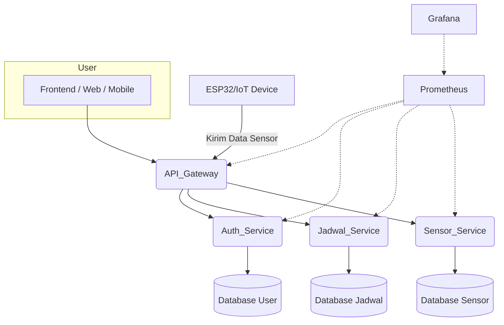

# Pisces65 IoT Feeder 🐟🚀

Sistem IoT feeder otomatis untuk akuakultur, berbasis arsitektur microservices dengan Node.js, Express, Sequelize, dan Docker Compose. Dirancang untuk pengembang indie yang ingin solusi modular, scalable, dan mudah di-deploy!

---

## ✨ Fitur Utama
- **Autentikasi & Manajemen User** (Session, Cookie, Bcrypt)
- **CRUD Jadwal Pemberian Pakan & Air**
- **Manajemen Data Sensor**
- **API Gateway & Monitoring (Grafana, Prometheus)**
- **Dockerized, Hot Reload, dan Mudah Dikembangkan**

---

## 🏗️ Arsitektur Microservices


<details open>
<summary>Diagram Arsitektur (Mermaid)</summary>



</details>

> Diagram di atas dapat dilihat langsung di editor markdown yang support Mermaid (misal: VSCode + plugin Markdown Preview Mermaid, GitHub, dll).

> Ganti gambar `docs/arsitektur-mikroservice.png` dengan diagram arsitektur asli jika ingin tampilan visual yang lebih baik.


---

## 🗂️ Struktur Direktori
```
services/
  ├── auth-service/
  ├── jadwal-service/
  └── sensor-service/
```

---

## ⚡ Instalasi Cepat

1. **Clone repo**
   ```bash
   git clone https://github.com/wSkidX/pbl_pisces65.git
   cd pbl_pisces65
   ```
2. **Edit file `.env`** (opsional, default sudah aman)
   ```env
   MYSQL_ALLOW_EMPTY_PASSWORD=yes
   MYSQL_DATABASE=db_authService
   DB_HOST=mysql
   DB_PORT=3306
   DB_NAME=db_authService
   DB_USER=root
   DB_PASSWORD=
   JWT_SECRET=your_jwt_secret
   ```
3. **Jalankan semua service**
   ```bash
   docker-compose up --build
   ```
4. **Akses API Gateway**
   - http://localhost:8080

---

## 🧩 Service & API Endpoint

### 📡 API Gateway Endpoint (Akses dari luar)
Semua endpoint service dapat diakses melalui API Gateway dengan path yang lebih singkat:

#### Auth
| Method | Endpoint         | Deskripsi           |
|--------|------------------|---------------------|
| POST   | /auth/register   | Register user       |
| POST   | /auth/login      | Login user, session |
| POST   | /auth/logout     | Logout session      |
| GET    | /auth/users      | List user           |
| GET    | /auth/users/:id  | Get user by id      |
| PUT    | /auth/users/:id  | Update user         |
| DELETE | /auth/users/:id  | Delete user         |

#### Jadwal
| Method | Endpoint               | Deskripsi           |
|--------|------------------------|---------------------|
| POST   | /jadwal/add            | Tambah jadwal       |
| GET    | /jadwal/get            | List semua jadwal   |
| GET    | /jadwal/get/:id        | Detail jadwal       |
| PUT    | /jadwal/update/:id     | Update jadwal       |
| DELETE | /jadwal/delete/:id     | Hapus jadwal        |

#### Sensor
| Method | Endpoint         | Deskripsi             |
|--------|------------------|-----------------------|
| POST   | /sensor          | Tambah data sensor    |
| GET    | /sensor          | List data sensor      |
| GET    | /sensor/:id      | Detail data sensor    |
| PUT    | /sensor/:id      | Update data sensor    |
| DELETE | /sensor/:id      | Hapus data sensor     |


---

## 🚦 Testing Otomatis Microservices (Tanpa MySQL)

- Semua service sudah support testing tanpa MySQL, cukup dengan SQLite in-memory.
- Jalankan semua test sekaligus dengan:
  ```powershell
  .\test-all.ps1
  ```
- Atau test per service:
  ```powershell
  $env:NODE_ENV="test"; npm test
  ```
- Test akan otomatis menggunakan SQLite dan tidak membutuhkan koneksi MySQL.

## ⚙️ Konfigurasi Environment
- Semua konfigurasi env bisa diatur di `.env` atau langsung di `docker-compose.yml`.
- Default: MySQL root tanpa password (`MYSQL_ALLOW_EMPTY_PASSWORD=yes`)

---

## 🐳 Perintah Docker Compose
- Jalankan semua service:
  ```bash
  docker-compose up --build
  ```
- Stop & hapus container + network:
  ```bash
  docker-compose down -v
  ```
- Cek log:
  ```bash
  docker-compose logs -f
  ```

---

## 🛡️ Security & Session
- Login menggunakan session cookie (`express-session`, `cookie-parser`)
- Password di-hash dengan bcrypt
- Semua endpoint sensitif hanya bisa diakses jika sudah login

---

## 🗄️ Database
- Migrasi otomatis dijalankan saat container start
- Skema utama:
  - **Users**: userid, email, password, nama, nohp, alamat
  - **Jadwal**: idjadwal, waktu_tanggal, waktu_jam, status
  - **SensorData**: id, jumlahPakanKering, jumlahAir

---

## 🚑 Troubleshooting
- **Access denied for user 'root'...**
  - Pastikan password MySQL kosong di `.env` & `docker-compose.yml`
  - Restart dengan `docker-compose down -v && docker-compose up --build`
- **Error module not found**
  - Pastikan semua file/folder sudah sesuai struktur di atas
- **Migrate gagal**
  - Cek env DB_NAME, DB_USER, DB_PASSWORD sudah konsisten

---

## Lisensi
MIT
